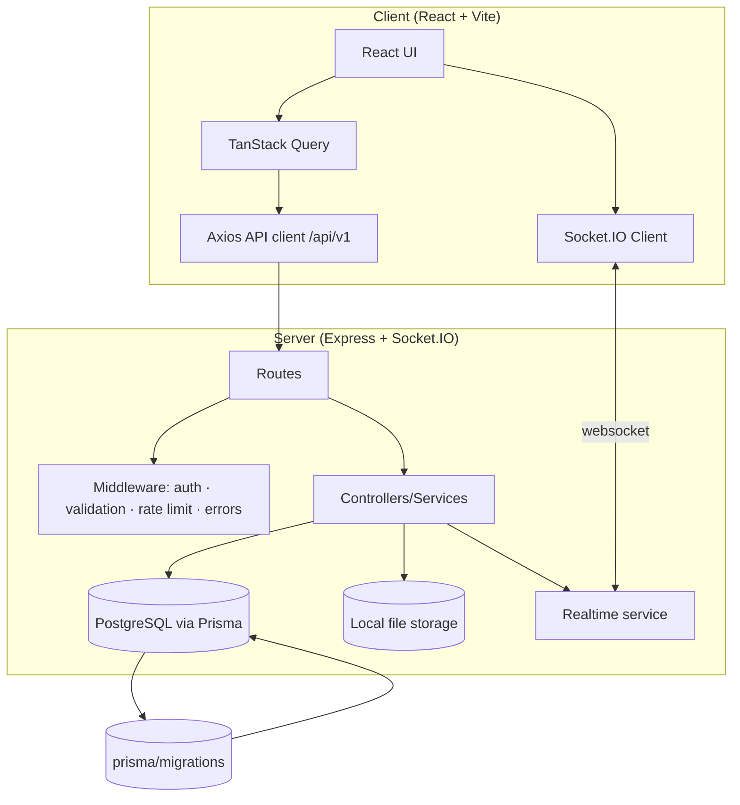
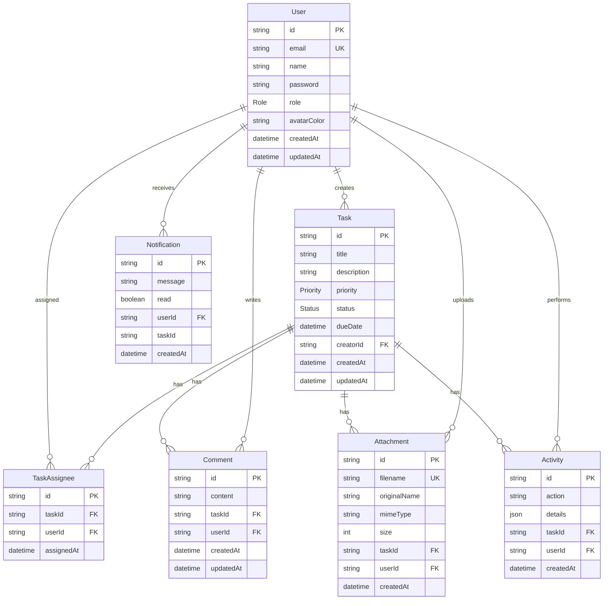
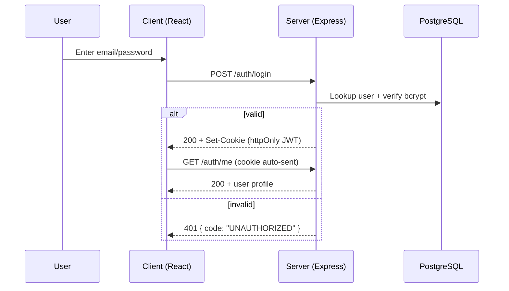

# Task Manager

A production-ready, open-source full-stack **Task Management Web Application** for creating, managing, assigning, tracking, and collaborating on tasks — complete with a responsive UI, role-based authorization, activity history, attachments, comments, real-time updates, and an integrated **"Watch Task Tutorial"** onboarding flow.

## Features

- **Authentication** — signup, login, logout, session endpoint, password hashing (bcrypt), JWT in HTTP-only cookies
- **Role-based access control** — `ADMIN`, `MANAGER`, `MEMBER` enforced on the server
- **Full task CRUD** — title, description, due date, priority (`LOW | MEDIUM | HIGH | URGENT`), status (`TODO | IN_PROGRESS | REVIEW | COMPLETED`), creator, assignees
- **Collaboration** — comments (create / edit / delete own), attachments with upload / download / delete
- **Activity history** — chronological audit trail of every important action, stored in PostgreSQL
- **Dashboard** — totals, todo, in-progress, completed, overdue, high-priority, recent, and per-user tasks
- **Search / filter / sort / paginate** the task list (status, priority, assignee, due date, keyword)
- **Extensible storage abstraction** — local-disk uploads today, pluggable for cloud storage later
- **Real-time updates** — Socket.IO for task updates, status changes, new comments, assignments, and notifications (modular; the REST API works without WebSockets)
- **Tutorial / onboarding** — prominent "Watch Task Tutorial" modal, easy to point at a video source later
- **Security** — rate-limited auth, CORS, helmet headers, Zod input validation, safe error messages, validated uploads, `.env`-managed secrets
- **Docker + Compose**, **GitHub Actions CI**, **unit / integration / E2E tests**

---

## Tech Stack

| Layer       | Technology                                                              |
| ----------- | ----------------------------------------------------------------------- |
| Frontend    | React 18, TypeScript, Vite, Tailwind CSS, React Router, TanStack Query, React Hook Form, Zod, Lucide React |
| Backend     | Node.js, Express.js, TypeScript, REST API (`/api/v1`), Socket.IO        |
| Database    | PostgreSQL, Prisma ORM                                                  |
| DevOps      | Docker + Docker Compose, GitHub Actions, `.env` configuration           |
| Testing     | Vitest + Supertest (unit/integration), Playwright (E2E)                  |

---

## Architecture



### Request flow

1. The React app authenticates via `/api/v1/auth` (token stored in an HTTP-only cookie).
2. Authenticated queries hit the versioned REST API; a JWT middleware + role gate authorizes every request.
3. Services validate input (Zod) and persist normalized data through Prisma.
4. Mutations write an `Activity` row and, when live sockets are connected, broadcast task events.
5. The Socket.IO client refreshes the TanStack Query cache in place — no manual reload.

---

## Database Design (ERD)



Key indexes: `Task(creatorId)`, `Task(status)`, `Task(priority)`, `Task(dueDate)`, `Task(createdAt)`, `TaskAssignee(taskId)`, `TaskAssignee(userId)` (unique composite `[taskId, userId]`), `Comment(taskId)`, `Attachment(taskId)`, `Activity(taskId)`, `Activity(createdAt)`, `Notification(userId, read)`. Foreign keys cascade on delete.

---

## Project Structure

```text
task-manager-app/
├── client/                     # React + Vite frontend
│   ├── src/
│   │   ├── components/         # Navbar, TutorialButton, modals...
│   │   ├── pages/              # Login, Signup, Dashboard, Tasks, TaskDetail, 404
│   │   ├── layouts/            # AuthLayout, MainLayout
│   │   ├── hooks/              # useAuth, useApi, useRealtime
│   │   ├── services/           # api.ts (axios), socket.ts (Socket.IO)
│   │   ├── types/              # shared TypeScript types
│   │   └── utils/              # helpers.ts
│   └── package.json
├── server/                     # Express + Prisma backend
│   ├── src/
│   │   ├── controllers/        # (routed via services/routes separation)
│   │   ├── routes/             # auth, task, comment, activity, user, notification, upload
│   │   ├── middleware/         # auth, errorHandler, validate
│   │   ├── services/           # auth, task, comment, activity, notification, upload, realtime
│   │   ├── validators/         # Zod schemas
│   │   ├── utils/              # prisma, response, fs
│   │   └── app.ts
│   ├── prisma/
│   │   ├── schema.prisma
│   │   ├── migrations/
│   │   └── seed.ts
│   └── tests/                  # Vitest unit + integration tests
├── e2e/                        # Playwright E2E tests
├── .github/workflows/ci.yml    # GitHub Actions
├── docker-compose.yml
├── .env.example
├── README.md
└── LICENSE
```

---

## Environment Variables

| Variable          | Where    | Default                       | Description                                  |
| ----------------- | -------- | ----------------------------- | -------------------------------------------- |
| `DATABASE_URL`    | server   | *(required)*                  | Prisma PostgreSQL connection string          |
| `JWT_SECRET`      | server   | *(required in production)*    | Secret used to sign JWTs                     |
| `JWT_EXPIRES_IN`  | server   | `7d`                          | Token lifetime                               |
| `PORT`            | server   | `3001`                        | API port                                     |
| `NODE_ENV`        | server   | `development`                 | Runtime environment                          |
| `CORS_ORIGIN`     | server   | `http://localhost:5173`       | Allowed browser origin                       |
| `UPLOAD_DIR`      | server   | `./uploads`                   | Attachment storage directory                 |
| `MAX_FILE_SIZE`   | server   | `10485760`                    | Max upload bytes (10 MB default)             |
| `VITE_API_URL`    | client   | `/api/v1`                     | Base URL for API calls                       |

Copy `.env.example` to `server/.env` (and optionally `client/.env`). **Never commit real secrets.**

---

## Local Setup

### 1. Prerequisites

- Node.js 18+
- PostgreSQL 15+ (or Docker)
- npm

### 2. Install dependencies

```bash
npm run install:all        # installs server + client
```

### 3. Configure environment

```bash
cp server/.env.example server/.env   # then fill in your DATABASE_URL and JWT_SECRET
```

### 4. Database setup

```bash
cd server

# Create and apply migrations
npx prisma migrate dev --name init

# (Optional) seed demo users:
#   admin@example.com / password123  (ADMIN)
#   manager@example.com / password123 (MANAGER)
#   member@example.com / password123  (MEMBER)
npm run prisma:seed
```

### 5. Run in development

```bash
npm run dev:server        # http://localhost:3001
npm run dev:client        # http://localhost:5173
```

Open http://localhost:5173, sign up (or use a seeded account), and click **Watch Task Tutorial**.

---

## Migration Commands

```bash
npm run prisma:migrate --prefix server        # create + apply (dev)
npm run prisma:migrate:prod --prefix server   # apply existing migrations (prod)
npm run prisma:studio --prefix server         # browse data
```

---

## REST API

Base URL: `/api/v1` — JSON everywhere.

```json
// Success
{ "success": true, "data": {}, "message": "Task created" }

// Error
{ "success": false, "error": { "code": "VALIDATION_ERROR", "message": "..." } }
```

### Authentication

| Method | Endpoint                    | Description                     |
| ------ | --------------------------- | ------------------------------- |
| POST   | `/auth/signup`              | Create account (sets cookie)    |
| POST   | `/auth/login`               | Log in (sets cookie)            |
| POST   | `/auth/logout`              | Clear session                   |
| GET    | `/auth/me`                  | Current user                    |

### Tasks *(auth required)*

| Method | Endpoint               | Description                                    |
| ------ | ---------------------- | ---------------------------------------------- |
| GET    | `/tasks`               | List w/ `page, limit, status, priority, search, assigneeId, sortBy, sortOrder, dueBefore, dueAfter` |
| POST   | `/tasks`               | Create                                         |
| GET    | `/tasks/:id`           | Detail (includes comments, attachments, activity) |
| PATCH  | `/tasks/:id`           | Partial update (title, description, status, priority, dueDate, assigneeIds) |
| DELETE | `/tasks/:id`           | Delete                                         |

### Comments

| Method | Endpoint                     | Description              |
| ------ | ---------------------------- | ------------------------ |
| GET    | `/tasks/:id/comments`        | List for task            |
| POST   | `/tasks/:id/comments`        | Add comment              |
| PATCH  | `/comments/:commentId`       | Edit (own, or admin/manager) |
| DELETE | `/comments/:commentId`       | Delete (same rules)      |
| GET    | `/tasks/:id/activity`        | Task activity history    |

### Attachments

| Method | Endpoint                  | Description                        |
| ------ | ------------------------- | ---------------------------------- |
| POST   | `/uploads/tasks/:taskId`  | Upload (`multipart/form-data` field `file`) |
| GET    | `/uploads/:filename`      | Download                           |
| DELETE | `/uploads/:id`            | Delete (uploader or admin/manager) |

### Users & Notifications

| Method | Endpoint                        | Description                     |
| ------ | ------------------------------- | ------------------------------- |
| GET    | `/users`                        | List users                      |
| GET    | `/users/:id`                    | User detail                     |
| GET    | `/notifications`                | My notifications                |
| PATCH  | `/notifications/:id/read`       | Mark one read                   |
| PATCH  | `/notifications/read-all`       | Mark all read                   |

---

## Authentication Flow



Every protected route runs `authenticate` (verifies the JWT from the HTTP-only cookie or `Authorization: Bearer` header).

---

## Authorization Rules

| Resource / Action                | ADMIN | MANAGER | MEMBER (creator / assignee) | Other MEMBER |
| -------------------------------- | :---: | :-----: | :-------------------------: | :----------: |
| View tasks / users               | ✅    | ✅      | ✅ (all tasks)              | ✅           |
| Create task                      | ✅    | ✅      | ✅                          | ✅           |
| Update any task                  | ✅    | ✅      | ⚠️ only own/assigned        | ❌           |
| Delete task                      | ✅    | ✅      | ⚠️ only own                 | ❌           |
| Edit / delete comments           | ✅    | ✅      | ✅ (own only)               | ❌           |
| Moderate comments (any)          | ✅    | ✅      | ❌                          | ❌           |
| Delete attachments               | ✅    | ✅      | ✅ (uploader)               | ❌           |

Enforcement is **always server-side** (middleware + service checks); the UI only hides controls.

---

## Tutorial / Onboarding

The **"Watch Task Tutorial"** button opens a 6-step modal covering: creating a task → assigning a task → changing status/priority → adding comments → uploading attachments → tracking activity history.

The flow is intentionally isolated (`client/src/components/TutorialButton.tsx`). To swap in a real video later, replace the step-array renderer with an embedded `<video>` / `<iframe>`; no other code changes are required.

---

## Testing

### Unit + Integration (server)

```bash
npm test --prefix server         # runs `vitest run`
```

Covers: Zod validation, auth service logic, auth API endpoints, task CRUD, authorization denial, and 404 handling (Prisma mocked).

### E2E (Playwright)

```bash
npm install                      # root devDependencies incl. @playwright/test
npx playwright install chromium
npm run test:e2e
```

Covers: **Signup → Login → Dashboard → Create Task → Assign User → Change Status → Add Comment → View Activity → Logout** (see `e2e/main-flow.spec.ts`).

---

## Docker

```bash
docker compose up --build
```

- `postgres` — PostgreSQL 16 with a healthcheck and a persistent volume
- `server` — builds, runs migrations (`prisma migrate deploy`), then starts the API on `:3001`
- `client` — builds the Vite app and serves it with nginx on `:5173`, proxying `/api` and `/socket.io` to the server

Teardown: `docker compose down` (add `-v` to remove volumes).

---

## CI/CD

`.github/workflows/ci.yml` runs on push/PR to `main` and `develop`:

1. Install dependencies (server + client)
2. Prisma generate + `migrate deploy` against a service PostgreSQL
3. Type checking (both)
4. Linting (both)
5. Unit + integration tests
6. Production build (both)
7. `docker compose build`

The workflow fails on any failing step.

---

## Deployment

### Option A — Docker (recommended)

```bash
docker compose -f docker-compose.yml up --build -d
```

Set real environment variables (especially `JWT_SECRET` and `DATABASE_URL`) via your host's environment or a secrets manager, not image defaults.

### Option B — Managed PostgreSQL (e.g. Neon)

```bash
cd server
npx prisma migrate deploy
npm run build && npm start
```

Point `DATABASE_URL` at your managed instance (add `?sslmode=require` for remote TLS), run `prisma generate` in the build stage, and serve the built `client/dist` from any static host or CDN with `/api` and `/socket.io` reverse-proxied to the API.

---

## Data Storage Abstraction

Uploads currently use a local-disk provider (`UploadService` + `uploads/`). To add S3 (or anything else), implement a matching method `put(key, buffer)` / `get(key)` / `delete(key)` behind the same interface and swap the implementation inside `UploadService` — nothing else changes.

---

## Contributing

Contributions are welcome! See [CONTRIBUTING.md](./CONTRIBUTING.md).

---

## Roadmap

- Notification center UI (list, mark-all-read, unread badge)
- Email verification & password reset
- Recurring tasks and task templates
- S3 / cloud attachment provider
- Task comments threading & mentions
- Webhook API and public share links
- Cypress/Playwright matrix in CI for all browsers
- Code-split routes for faster initial load

---

## License

[MIT](./LICENSE)

Copyright (c) 2024 Task Manager Contributors